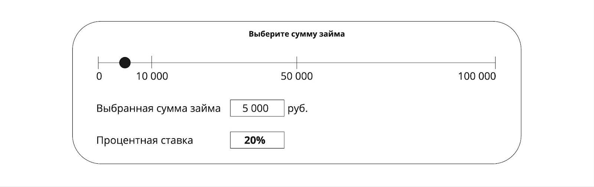
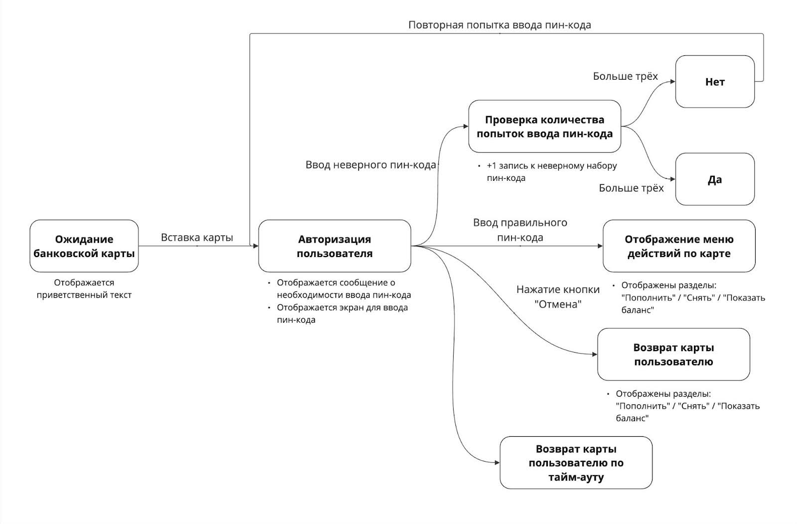

### **Задание 1. Классы эквивалентности**

Представьте себе ресурс по выдаче кредитов. На ресурсе есть поле ввода логина. По техническому заданию поле можно заполнять любыми символами (минимальное и максимальное количество символов неважно). Требуется протестировать данное поле. Что нужно сделать:

1. Определить классы эквивалентности.
2. Указать, какими символами от каждого класса будем тестировать.

### **Задание 2. Граничные значения**

Проверка онлайн-калькулятора. Проверка расчетной процентной ставки по кредиту.

**Условия:**

- Для выставления нужной суммы пользователь использует ползунок шкалы  величины займа (чёрный кружок).
- При займе суммы до 10 000 руб. процентная ставка = 20%.
- При займе от 10 000 до 50 000 руб. процентная ставка = 15%.
- При займе от 50 000 руб. процентная ставка = 10%.
- Максимальная сумма займа = 100 000 руб.
- Минимальный шаг шкалы калькулятора = 1 000 руб.
- Границу «0» (ноль) не тестируем.

**Задание:**

1. Определить граничные значения для данной функциональности.
2. Указать, какими значениями будет протестирован калькулятор. 

### **Задание 3. Таблица переходов и состояний**

1. Построить диаграмму переходов и состояний для страницы авторизации <https://applicant.21-school.ru/auth>.

### **Задание 4. Техника уникальных пар**

1. Возраст (18–35/36–55/56–75).
2. Наличие любых задолженностей (да/нет).
3. Тип трудовых отношений (ИП / Самозанятый / Бессрочный договор).
4. Наличие действующих кредитов (да/нет).

**Что нужно сделать:**

1. Подсчитать количество всех возможных комбинаций.
1. Составить комбинации, используя технику уникальных пар.

### **Задание 5. Тестовые туры**

1. Составить тестовые туры для проверки данного раздела по Заданию 2 из проекта QA2_Test artifacts («Тестовые артефакты»).
